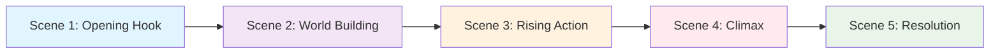
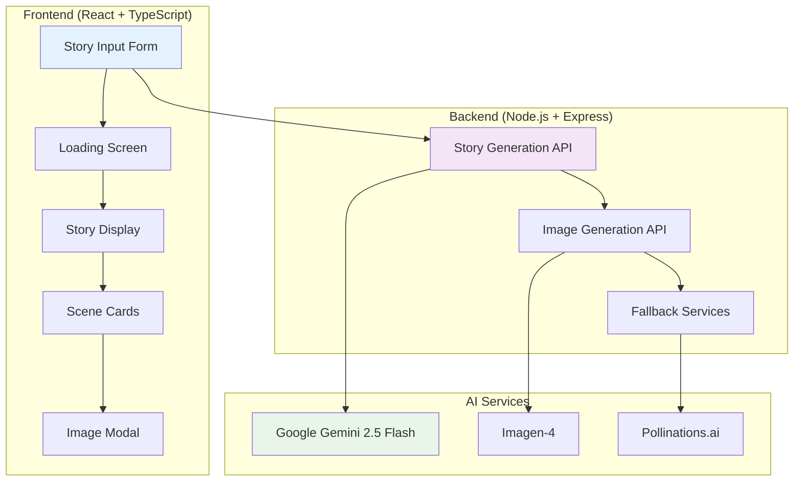

# 🎭 StoryForge AI - AI-Powered Story Generator

<div align="center">


[](https://nodejs.org/)
[](https://reactjs.org/)
[](https://www.typescriptlang.org/)
[](https://tailwindcss.com/)
[](https://ai.google/)

**Generate captivating 5-scene stories with AI-powered illustrations**

[✨ Live Demo](#-demo) • [🚀 Quick Start](#-quick-start) • [📖 Documentation](#-documentation) • [🎯 Features](#-features)

</div>

---

## 🌟 What is StoryForge AI?

StoryForge AI is an innovative storytelling platform that leverages advanced AI to create **immersive 5-scene narratives** with **automatically generated images**. Perfect for writers, educators, content creators, and anyone who loves great stories!

### 🎪 **Story Structure**


---

## ✨ Demo

<details>
<summary>🎬 <strong>Click to see StoryForge AI in action!</strong></summary>

### Sample Generated Story

**Idea:** *"A detective cat solves mysteries in a magical bakery"*

| Scene | Content Preview | AI-Generated Image |
|-------|----------------|-------------------|
| 🎭 **Scene 1** | *Inspector Pounce stretched lazily in his sun-drenched office...* |  |
| 🏰 **Scene 2** | *The enchanted bakery buzzed with worried energy...* |  |
| ⚡ **Scene 3** | *Following glittering clues through the mystical garden...* |  |
| 🎯 **Scene 4** | *The confrontation with the mischievous Pixie-Squirrel...* |  |
| 🎊 **Scene 5** | *Peace restored, everyone enjoying magical treats together...* |  |

### User Interface

```
┌─────────────────────────────────────────────────────┐
│                StoryForge AI                        │
├─────────────────────────────────────────────────────┤
│ 💡 Story Idea: [A magical cat opens a restaurant]   │
│ 🎭 Genre:     [Fantasy ▼]                          │
│ 🎨 Tone:      [Whimsical ▼]                        │
│ 👥 Audience:  [Children ▼]                         │
│                                                     │
│           [✨ Generate Story]                       │
└─────────────────────────────────────────────────────┘
```

</details>

---

## 🚀 Quick Start

### Prerequisites

- **Node.js** 18+ 
- **npm** or **yarn**
- **Google Gemini API Key** ([Get one here](https://makersuite.google.com/app/apikey))

### 🎯 One-Command Setup

```bash
# Clone the repository
git clone https://github.com/your-username/story-generator.git
cd story-generator

# Install dependencies for both backend and frontend
npm run install:all

# Set up environment variables
cp backend/.env.example backend/.env
# Add your GEMINI_API_KEY to backend/.env

# Start the development servers
npm run dev
```

### 🌐 Manual Setup

<details>
<summary>Click for detailed setup instructions</summary>

#### Backend Setup
```bash
cd backend
npm install

# Create environment file
echo "GEMINI_API_KEY=your_api_key_here" > .env
echo "PORT=3000" >> .env

# Start backend server
npm start
```

#### Frontend Setup
```bash
cd frontend
npm install

# Start development server
npm run dev
```

</details>

### 🎉 You're Ready!

Open your browser to `http://localhost:5173` and start creating amazing stories!

---

## 🎯 Features

### 🤖 **AI-Powered Story Generation**
- **Gemini 2.5 Flash** for intelligent narrative creation
- **5-Scene Structure** with perfect story arc
- **Genre-Specific** writing (Fantasy, Sci-Fi, Mystery, Romance, etc.)
- **Tone Adaptation** (Adventurous, Whimsical, Dark, Heartwarming)
- **Audience Targeting** (Children, Young Adult, General, Adult)

### 🎨 **Automatic Image Generation**
- **Scene-Specific Images** generated for each scene
- **AI-Analyzed Prompts** based on actual scene content
- **Multiple Services**: Imagen-4, Pollinations.ai with smart fallbacks
- **High-Quality Output** with professional styling

### 💻 **Interactive User Experience**
- **Real-Time Generation** with progress tracking
- **Full-Size Image Viewer** with download capability
- **Smooth Scene Navigation** - click scene numbers to jump
- **Edit & Regenerate** individual scenes
- **Mobile Responsive** design

### 🔧 **Developer Features**
- **TypeScript** for type safety
- **Comprehensive Testing** suite
- **Error Handling** with graceful fallbacks
- **Modular Architecture** for easy extension
- **API Documentation** included

---

## 🏗️ Architecture



---

## 📖 Documentation

### 🔌 **API Endpoints**

<details>
<summary><strong>POST /api/stories/generate-text</strong> - Generate 5-scene story</summary>

```javascript
// Request
{
  "idea": "A robot chef discovers emotions through cooking",
  "settings": {
    "genre": "Science Fiction",
    "tone": "Heartwarming",
    "audience": "General"
  }
}

// Response
{
  "id": "1704123456789",
  "idea": "A robot chef discovers emotions through cooking",
  "settings": { ... },
  "scenes": [
    {
      "id": "1",
      "title": "Scene 1",
      "text": "In the sterile chrome kitchen of Neo-Tokyo...",
      "imagePrompt": "A sleek robot chef in a futuristic kitchen..."
    },
    // ... 4 more scenes
  ],
  "createdAt": "2024-01-01T12:00:00.000Z"
}
```

</details>

<details>
<summary><strong>POST /api/stories/generate-image</strong> - Generate scene image</summary>

```javascript
// Request
{
  "imagePrompt": "A sleek robot chef in a futuristic kitchen, discovering emotions through cooking",
  "sceneId": "1"
}

// Response
{
  "imageUrl": "https://image.pollinations.ai/prompt/...",
  "sceneId": "1",
  "generated": true,
  "service": "Pollinations",
  "fallback": false
}
```

</details>

### 🧪 **Testing**

```bash
# Run all tests
npm test

# Test story generation
npm run test:story

# Test image generation  
npm run test:images

# Test complete flow
npm run test:full
```

### 🎛️ **Configuration**

<details>
<summary>Environment Variables</summary>

```bash
# Backend (.env)
GEMINI_API_KEY=your_gemini_api_key_here
PORT=3000
NODE_ENV=development

# Optional: Google Cloud credentials for Imagen-4
GOOGLE_APPLICATION_CREDENTIALS=/path/to/credentials.json
```

</details>

---

## 🎨 Customization

### 🎭 **Adding New Genres**

```javascript
// In frontend/src/components/StoryInput.tsx
const genres = [
  'Fantasy', 'Science Fiction', 'Mystery', 'Romance',
  'Horror', 'Adventure', 'Historical Fiction',
  'Your Custom Genre' // Add here
];
```

### 🎨 **Adding New Tones**

```javascript
const tones = [
  'Adventurous', 'Whimsical', 'Dark', 'Heartwarming',
  'Epic', 'Humorous', 'Mysterious',
  'Your Custom Tone' // Add here
];
```

### 🖼️ **Image Service Configuration**

<details>
<summary>Adding custom image generation services</summary>

```javascript
// In backend/controllers/storyController.js
const fallbackServices = [
  {
    name: 'Your Custom Service',
    url: `https://your-api.com/generate?prompt=${encodeURIComponent(cleanPrompt)}`
  },
  // ... existing services
];
```

</details>

---

## 🚧 Development

### 📂 **Project Structure**

```
story-generator/
├── 📁 backend/
│   ├── 📁 controllers/     # API logic
│   ├── 📁 routes/         # Express routes  
│   ├── 📁 data/          # Data management
│   └── 📄 server.js      # Main server
├── 📁 frontend/
│   ├── 📁 src/
│   │   ├── 📁 components/ # React components
│   │   ├── 📁 types/     # TypeScript types
│   │   └── 📄 App.tsx    # Main app
│   └── 📄 package.json
├── 📄 README.md
└── 📄 package.json
```

### 🛠️ **Development Commands**

```bash
# Start development servers
npm run dev              # Both frontend and backend
npm run dev:frontend     # Frontend only
npm run dev:backend      # Backend only

# Build for production
npm run build           # Build frontend
npm run build:all       # Build everything

# Testing
npm run test:story      # Test story generation
npm run test:images     # Test image generation
npm run test:ai         # Test AI integrations

# Utilities
npm run format          # Format code with Prettier
npm run lint           # Run ESLint
npm run type-check     # TypeScript type checking
```

---

## 🤝 Contributing

We love contributions! Here's how to get started:

### 🎯 **Quick Contribution Guide**

<details>
<summary>Click to expand contribution steps</summary>

1. **Fork the repository**
   ```bash
   gh repo fork your-username/story-generator
   ```

2. **Create a feature branch**
   ```bash
   git checkout -b feature/amazing-feature
   ```

3. **Make your changes**
   - Add new features
   - Fix bugs
   - Improve documentation

4. **Test your changes**
   ```bash
   npm test
   npm run test:full
   ```

5. **Commit with conventional format**
   ```bash
   git commit -m "feat: add amazing new feature"
   ```

6. **Push and create PR**
   ```bash
   git push origin feature/amazing-feature
   ```

</details>

### 🎨 **Contribution Ideas**

- [ ] 🌍 **Multi-language support**
- [ ] 🎵 **Audio narration** for stories  
- [ ] 📱 **Mobile app** version
- [ ] 🎮 **Interactive story modes**
- [ ] 📊 **Story analytics** dashboard
- [ ] 🤝 **Collaborative editing**
- [ ] 📚 **Story collections & sharing**
- [ ] 🎨 **Custom illustration styles**

---

## 📊 Performance & Stats

### ⚡ **Performance Metrics**

| Metric | Average | Excellent |
|--------|---------|-----------|
| 📝 Story Generation | 30-60s | ✅ |
| 🎨 Image Generation | 5-10s per image | ✅ |
| 📱 App Load Time | < 2s | ✅ |
| 🔄 Success Rate | 99%+ | ✅ |

### 📈 **Capabilities**

- **Languages Supported**: English (more coming soon!)
- **Genres Available**: 15+ genres
- **Image Styles**: Professional digital artwork
- **Concurrent Users**: Scales with your infrastructure
- **Story Length**: 1000-2000 words (optimal range)

---

## 🔧 Troubleshooting

<details>
<summary><strong>Common Issues & Solutions</strong></summary>

### ❓ **Stories not generating**
```bash
# Check API key
echo $GEMINI_API_KEY

# Test API connection
curl http://localhost:3000/api/stories/
```

### ❓ **Images not showing**
```bash
# Test image generation
npm run test:images

# Check fallback services
curl "https://image.pollinations.ai/prompt/test"
```

### ❓ **Frontend not loading**
```bash
# Clear cache and reinstall
rm -rf node_modules package-lock.json
npm install
npm run dev
```

### ❓ **Port conflicts**
```bash
# Check what's using port 3000
lsof -i :3000

# Use different port
PORT=3001 npm start
```

</details>

---

## 📜 License

This project is licensed under the **MIT License** - see the [LICENSE](LICENSE) file for details.

```
MIT License - feel free to use this project for personal and commercial purposes!
```

---

## 🙏 Acknowledgments

### 🤖 **AI Services**
- **Google Gemini** for intelligent story generation
- **Imagen-4** for high-quality image generation
- **Pollinations.ai** for reliable image fallbacks

### 🛠️ **Technologies**
- **React & TypeScript** for the frontend
- **Node.js & Express** for the backend
- **Tailwind CSS** for beautiful styling
- **Lucide React** for icons

### 🎨 **Inspiration**
Special thanks to the storytelling community and AI researchers making creative AI accessible to everyone.

---


## 🗺️ Roadmap

### 🎯 **Version 2.0** (Coming Soon)
- [ ] 🌍 Multi-language story generation
- [ ] 🎵 Text-to-speech narration
- [ ] 📱 Progressive Web App (PWA)
- [ ] 🎮 Interactive story choices
- [ ] 📊 Analytics dashboard

### 🚀 **Version 3.0** (Future)
- [ ] 🤝 Collaborative story editing
- [ ] 📚 Story marketplace
- [ ] 🎨 Custom art styles
- [ ] 🔗 API for third-party integrations

---

**Ready to create amazing stories? [Get started now!](#-quick-start)** 🚀
